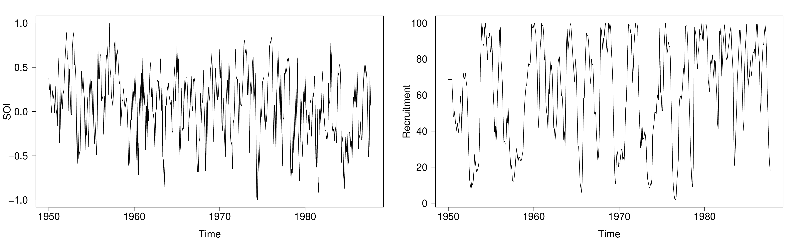
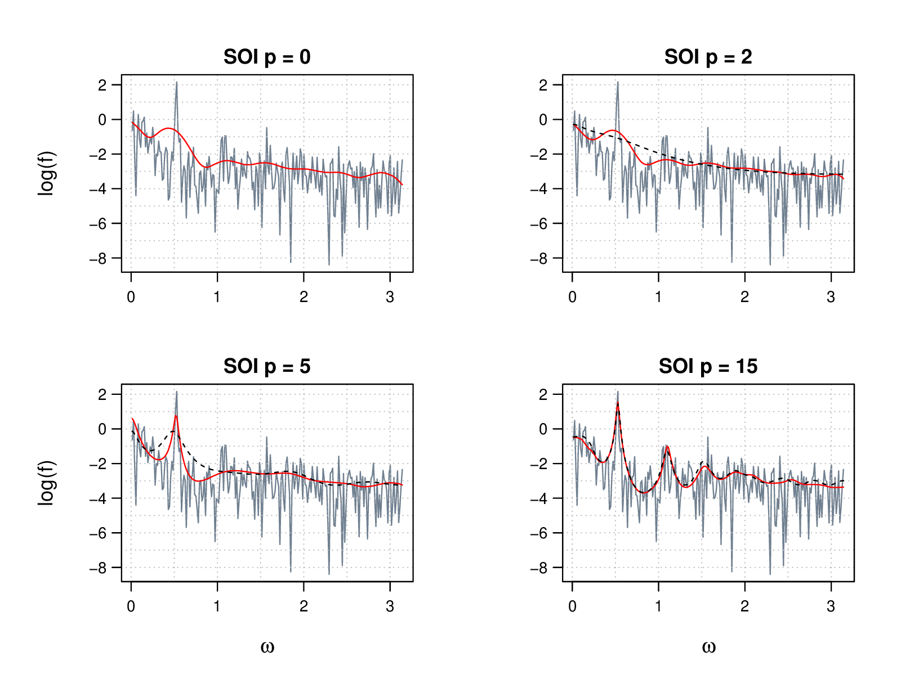
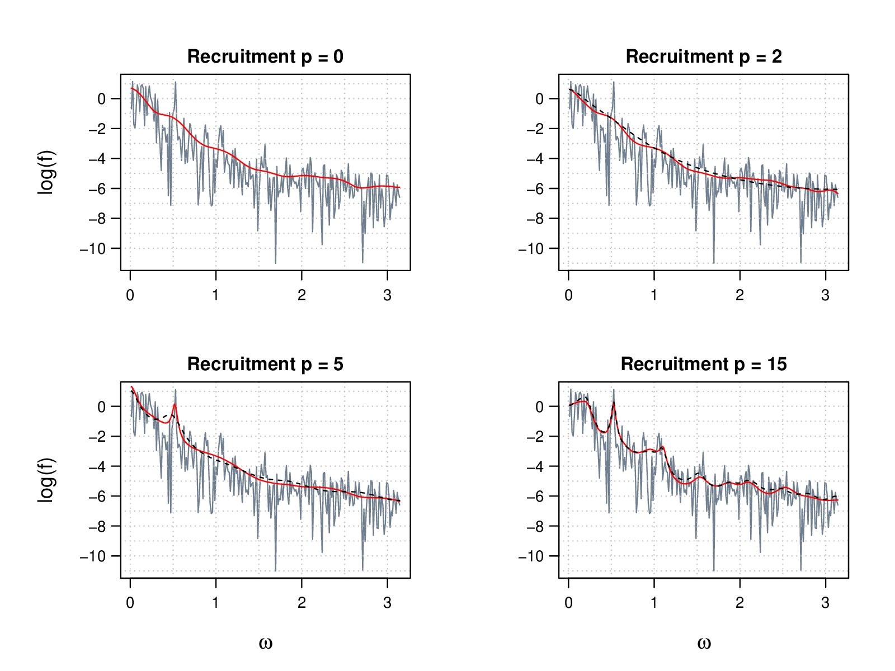
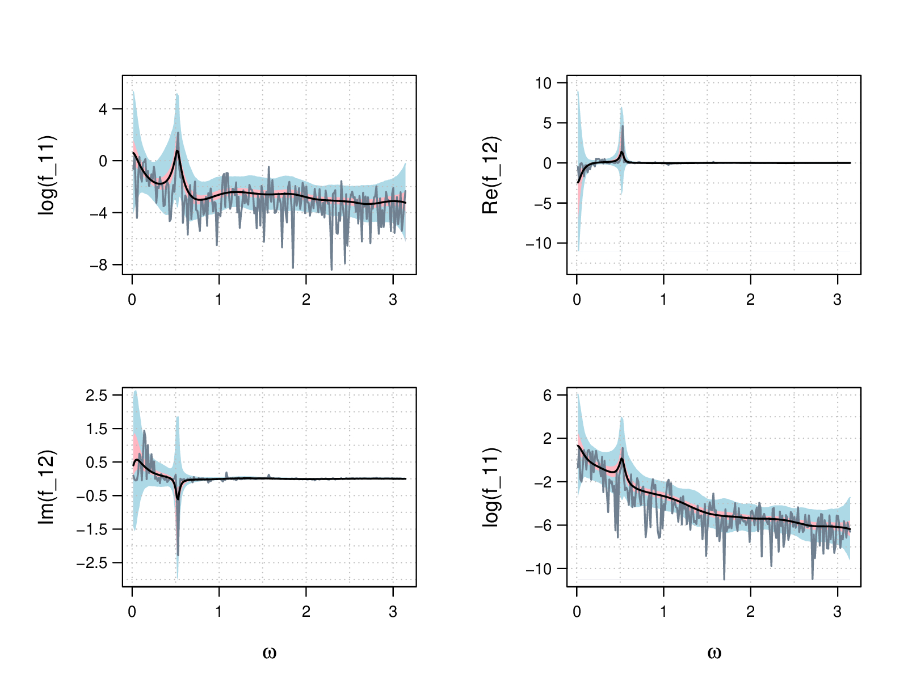
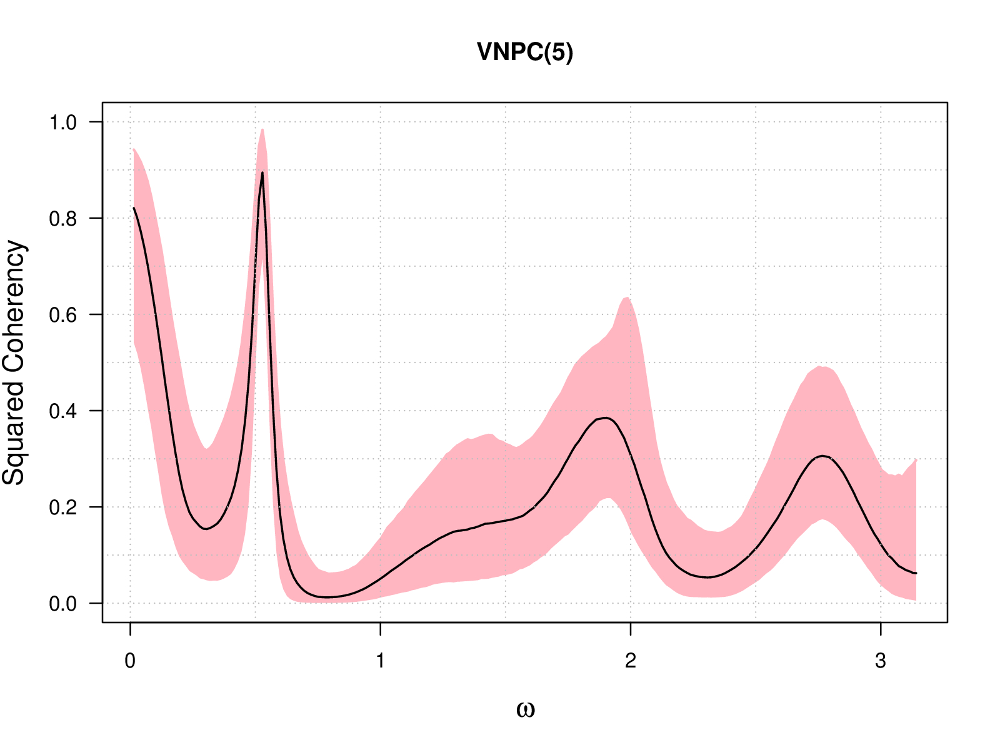

Multivariate Bayesian spectral inference
================
2023-05-07

# 1 gibbs_vnpc()

This is the source code of the multivariate corrected likelihood (VNPC)
approach proposed for multivariate Bayesian spectral inference. The
execution of this approach is on R, while the core functions used in the
algorithm are written on C++ to enhance the performance.

The reference of the VNPC approach is on arXiv
<https://arxiv.org/abs/2306.04966>.

# 2 A Metropolis-within-Gibbs algorithm

This Section introduces the MCMC algorithm used by the VNPC approach to
sample the joint posterior distributions of the Hpd-Gamma process
parameters $\mathbf{\Phi}$, the number of Bernstein polynomials $k$ and
the coefficient matrices of the parametric VAR working model
$\underline{\boldsymbol{B}}$. In particular, $\mathbf{\Phi}$ is
hierachically parametrised by $r_{l}$’s, $x_{l}$’s and
$\boldsymbol{U_{l}}$’s.

## 2.1 Reparametrisation of $\boldsymbol{U_{l}}$

We represent $\boldsymbol{U_{l}}$’s by some hyperspherical coordinates
$\varphi_{l}$’ s introduced by Mittelbach et al. (2012) in its Section
IV. To elaborate, consider the Cholesky decomposition of
$\boldsymbol{U}$ such that
$\boldsymbol{U}=\boldsymbol{U}_{L}\boldsymbol{U}_{L}^{*}$ with the lower
triangular matrix $\boldsymbol{U}_{L}$ as
$$\boldsymbol{U}:=\begin{pmatrix}y_{1} & 0 & 0 & \cdots & 0\\
    y_{2}-iy_{3} & y_{4} & 0 & \cdots & 0\\
    y_{5}-iy_{6} & y_{7}-iy_{8} & y_{9} & \cdots & 0\\
    \vdots & \vdots & \vdots & \ddots & \vdots\\
    y_{(d-1)^{2}+1}-iy_{(d-1)^{2}+2} & y_{(d-1)^{2}+3}-iy_{(n-1)^{2}+4} & y_{(d-1)^{2}+5}-iy_{(d-1)^{2}+6} & \cdots & y_{d^{2}}\end{pmatrix}$$.
According to the definition of $\boldsymbol{U}$, it holds that
$$\text{tr}(\boldsymbol{U})=\text{tr}(\boldsymbol{U}_{L}\boldsymbol{U}^{*})=\sum_{k=1}^{d^{2}}y_{k}^{2}=1$$.
Thus, $y_{1},...,y_{d^{2}}$ can be represented by the hyperspherical
coordinates $\varphi_{1},...,\varphi_{d^{2}}$ as
$$u_{k}=\begin{dcases}\cos(\varphi_{k})\prod_{l=1}^{k-1}\sin(\varphi_{l}),\quad &k=1,...,d^{2}-1\\
    \prod_{l=1}^{k-1}\sin(\varphi_{l}),&k=d^{2},\end{dcases}$$ with the
range of $\varphi_{k}$ for $k=1,2,...,d^{2}-1$ given by
$$ \mathcal{I}_{k}=\begin{dcases}
    \left(0,\frac{\pi}{2}\right),\quad&\text{if $k=j^{2}$ for $j=1,2,..,(d-1)$}\\
    (0,\pi),&\text{else}.
    \end{dcases}$$ Denote by $\boldsymbol{U}=(u_{ij})_{i,j=1}^{d}$.
Consider the mapping
$$\tilde{T}:\mathbb{R}^{d^{2}-1}\rightarrow\mathcal{I}:=\otimes_{k=1}^{d^{2}-1}\mathcal{I}_{k}:$$
$$
    (u_{11},\mathfrak{R}(u_{12}),\mathfrak{I}(u_{12}),u_{22},...,\mathfrak{R}(u_{(d-1),d}),\mathfrak{I}(u_{(d-1),d}))\mapsto\underline{\varphi}:=(\varphi_{1},...,\varphi_{d^{2}-1}),$$
such that the upper triangular elements of $\boldsymbol{U}$ without
$u_{dd}$ are transformed to the hyperspherical coordinates. Then the
absolute value of the determinant of the Jacobian
$\boldsymbol{J}_{\tilde{T}^{-1}}$ for the inverse mapping
$\tilde{T}^{-1}$ is given by
$$|\boldsymbol{J}_{\tilde{T}^{-1}}(\underline{\varphi})|=\prod_{k=1}^{d^{2}-1}\cos^{p_{k}}(\varphi_{k})\sin^{q_{k}}(\varphi_{k})$$
with the exponents $$p_{k}=\begin{dcases}
    2(d-j)+1,\quad&\text{if $k=j^{2}, j=1,2,...,(d-1)$}\\
    0,&\text{else},
    \end{dcases}$$ and
$$q_{k}=2(d^{2}-jd)-1-m\ \text{for $k=j^{2}+m, j=1,2,...,(d-1), m=0,1,...,2j$}.$$

Therefore, a new parametrisation of $\mathbf{\Phi}$ is given by
$$\tilde{\underline{\Theta}}_{\mathbf{\Phi}}:=(r_{1},...,r_{L},x_{1},...,x_{L},\underline{\varphi}_{1},...,\underline{\varphi}_{L})$$.

## 2.2 Algorithm

We begin with the initial values
$(\underline{\tilde{\Theta}}_{\mathbf{\Phi}}^{(1)},k^{(1)},\underline{\boldsymbol{B}}^{(1)})$.
Some large values are chosen for $k^{(1)}$ and
$\underline{\tilde{\Theta}}_{\mathbf{\Phi}}^{(1)}$, within which
$r_{1}^{(1)},...,r_{L}^{(1)}\overset{iid}{\sim}\text{Exp}(1)$,
$x_{1},...,x_{L}\overset{iid}{\sim}\text{Unif}(0,\pi)$ and
$\varphi_{1}^{(1)},...,\varphi_{L}^{(1)}\overset{iid}{\sim}\text{Unif}(\mathcal{I})$
with $\mathcal{I}=\otimes^{d^{2}-1}_{j=1}I_{j}$. The initial matrices
for $\boldsymbol{B}_{1},..., \boldsymbol{B}_{p}$ are given by a
Yule-Walker estimate. To update the value of $k$, the proposed
$k^{*,(i+1)}$ for the MH step in the $i+1$-th iteration of the Gibbs
sampler follows
$$k^{*,(i+1)}:=\max\lbrace k_{\max}, \max\lbrace1,k^{(i)}+\lfloor\epsilon_{k}^{(i+1)}\rfloor\rbrace\rbrace,\quad\epsilon_{k}^{(i+1)}\sim\text{Cauchy}(0,1).$$
$k_{\max}$ should be some large finite integer, and it controls the
upper bound for the polynomial degree of the Bernstein-Hpd-Gamma
mixture. Clearly, to prevent oversmoothing, the value of $k_{\max}$
should be as large as possible. However, a high value for $k_{\max}$
also results in a highly memory-intensive problem in practice, so the
value should depend on the posterior distribution and be predetermined
by the pilot run of the algorithm. It is found that $200$ is a
sufficiently large number for $k_{\max}$ in most cases.

To draw the radial parts $r_{1},...,r_{L}$, the individual MH steps are
used to update the $L$ values once each time. The proposed value for
each $r_{l}$ in the $i+1$-th iteration comes from a Log-Normal
distribution centred at the logarithmic value of the last iteration:
$$ r^{*,(i+1)}_{l}\sim\text{LN}\left(\log(r_{l}^{(i)}),\sigma_{r_{l}}^{2}\right),\quad l=1,...,L.$$
It is well known that a well-proposed variance can improve the mixing
time of a Markov chain in high dimensions, but it is also difficult to
predetermine the value thereof. To deal with this, an adaptive
Metropolis-within-Gibbs algorithm as suggested by Robert & Rosenthal
(2009) (see its Section 3) is used with the value of
$\sigma_{r_{l}}^{2}$ updated during the burn-in period. To elaborate, we
define $s_{r_{l}}:=\log(\sigma_{r_{l}})$, the logarithm of the standard
deviation, and we update its value during the burn-in period for every
particular number, say $M$, of iterations. We set $s_{r_{l}}^{(1)}=1$
for all $r_{l}$’s and update each of their values in an MH step by some
acceptance rates $$s_{r_{l}}^{(i+1)}=\begin{dcases}
        s_{r_{l}}^{(i)}+\delta_{\text{adapt}}^{(i)},\quad a_{r_{l},M}^{(i)}>a^{*},\\
        s_{r_{l}}^{(i)}-\delta_{\text{adapt}}^{(i)},\quad a_{r_{l},M}^{(i)}<a^{*},
    \end{dcases}$$ with $a_{r_{l},M}^{(i)}$ being the acceptance rate
for the $i$-th adaption batch of the iterations during the burn-in
period and $a^{*}\in(0,1)$ being the target acceptance rate and
$\delta_{\text{adapt}}^{(i)}>0$ being the adaption step width. To decide
the value of $s_{r_{l}}$ increases or decreases by
$\delta_{\text{adapt}}$, we can set the target acceptance rate $a^{*}$
to be $0.44$, which is optimal in some specific one-dimensional cases
(see Robert et al. (1997); Robert & Rosenthal (2001)). Moreover, the
adaption step width is chosen by
$\delta_{\text{adpat}}=\min(0.05, i^{-1/2})$ and the adaption batch size
is used as $M=50$. After the burn-in period, the value of $s_{r_{l}}$ is
fixed to be $s_{r_{l}}^{(N_{\text{burn}})}$, and accordingly, the
variance scaling is fixed to be
$\sigma_{r_{l}}^{2}=\exp(2s_{r_{l}}^{(N_{\text{burn}})})$.

We update the values of $x_{1},...,x_{L}$ on $[0,\pi]$ in each iteration
with the individual MH steps analogously to the similar steps used in
Choudhuri et al. (2004) for the mass location parameter of a Dirichlet
process, in which the $x_{l}$’s are defined on $[0,1]$. The idea is
taking a candidate value $\tilde{x}_{l}^{*,(i+1)}$ of $x_{l}^{*,(i+1)}$
from a uniform distribution on
$[x_{l}^{(i)}-\epsilon_{x_{l}}, x_{l}^{(i)}+\epsilon_{x_{l}}]$, then the
value of $x_{l}^{*,(i+1)}$ is ensured to be on $[0, \pi]$ for different
cases of the candidate value:
$$\tilde{x}_{l}^{*,(i+1)}:=x_{l}^{(i)}+\epsilon_{x_{l}},\quad \epsilon_{x_{l}}\sim\text{Unif}(-\delta_{x_{l}},\delta_{x_{l}}),$$
$$
    x_{l}^{*,(i+1)}=\begin{dcases}
        \tilde{x}_{l}^{*,(i+1)}+\pi,\quad \tilde{x}_{l}^{*,(i+1)}<0,\\
        \tilde{x}_{l}^{*,(i+1)}-\pi,\quad \tilde{x}_{l}^{*,(i+1)}>\pi,\\
        \tilde{x}_{l}^{*,(i+1)},\quad\text{else},
    \end{dcases}$$ and the proposal scaling is used as
$\delta_{x_{l}}=\pi l/(l+2\pi)$. This fixed scaling value has been shown
to be able to produce feasible mixing properties in practice.

The hyperspherical coordinates $\underline{\varphi}_{l}$’s are sampled
in the MH step with one block each time instead of one component
$\varphi_{l,1}.,,,,\varphi_{l,d^{2}-1}$ of $\underline{\varphi}_{l}$
each time. According to this design, the computational cost can be much
saved, and the posterior correlation between each component of
$\underline{\varphi}_{l}$ is also considered by the blocked sampling.
The proposal value of each component of
$\underline{\varphi}_{l}^{*,(i+1)}$ is determined to be on $\mathcal{I}$
based on the corresponding component of a candidate vector
$\tilde{\underline{\varphi}}^{*,(i+1)}$, which uniformly varies from
$\underline{\varphi}_{l}^{(i)}-\epsilon_{\underline{\varphi}_{l}}$ to
$\underline{\varphi}_{l}^{(i)}+\epsilon_{\underline{\varphi}_{l}}$:
$$\tilde{\underline{\varphi}}^{*,(i+1)}:=\underline{\varphi}_{l}^{(i)}+\epsilon_{\underline{\varphi}_{l}},\quad \epsilon_{\underline{\varphi}_{l},j}\overset{\text{ind.}}{\sim}\text{Unif}\left(-\delta_{\underline{\varphi}_{l}}\max(\mathcal{I}_{j}), \delta_{\underline{\varphi}_{l}}\max(\mathcal{I}_{j})\right),$$
$$\varphi_{l,j}^{*,(i+1)}=\begin{dcases}
        \tilde{\varphi}_{l,j}^{*,(i+1)}+\max(\mathcal{I}_{j}),\quad \tilde{\varphi}_{l,j}^{*,(i+1)}<0,\\
        \tilde{\varphi}_{l,j}^{*,(i+1)}-\max(\mathcal{I}_{j}),\quad \tilde{\varphi}_{l,j}^{*,(i+1)}>\max(\mathcal{I}_{j}),\\
        \tilde{\varphi}_{l,j}^{*,(i+1)},\quad\text{else},
    \end{dcases}$$ for $l=1,...,L$ and $j=1,...,d^{2}-1$. We globally
(not consider $j$) adaptively update the value of the scaling parameter
$\delta_{\underline{\varphi}_{l}}$ during the burn-in period using the
same design for $\sigma_{l}^{2}$ discussed before.

The last dozen of parameters to be updated are the coefficient matrices
$\boldsymbol{B}_{1},...,\boldsymbol{B}_{p}$ of the parametric working
model. To do that, we apply the multivariate normal random walk for the
full conditional for $\boldsymbol{B}_{j}^{*,(i+1)}$ in the MH step,
$j=1,...,p$ as
$$\boldsymbol{B}_{j}^{*,(i+1)}|\underline{\tilde{\Theta}}_{\mathbf{\Phi}}^{(i+1)},k^{(i+1)}\sim N(\boldsymbol{B}_{j}^{(i)},\boldsymbol{V}),$$
with the covariance matrix $\boldsymbol{V}$ being globally adaptively
updated during the burn-in period by the same idea as $\sigma_{l}^{2}$
and $\delta_{\underline{\varphi}}$.

# 3 The Southern Oscillation example

Here are the estimates for the famous bivariate Southern Oscillation
study. There are two series in this example, the Southern Oscillation
Index (SOI) and the associated fish recruitment series, which are
simultaneously recorded to explore the El Nino cycle (see Shumway &
Stoffer (2011)).

Both series consist of a period of 453 monthly values over the years
1950-1987, which are shown in Figure <a href="#fig:Fig1">3.1</a>. The
data is available in the R package `astsa` as datasets `soi` and `rec`
(see Stoffer (2022)).

Figure 3.1: The SOI and Recruitment series

Both series are estimated simultaneously. Figures
<a href="#fig:Fig2">3.2</a> and <a href="#fig:Fig3">3.3</a> show the
estimates of the VNPC approach using different parametric working model
orders p. As a comparison, we also consider the parametric vector
autoregressive model (VAR) with the same orders. Figure
<a href="#fig:Fig4">3.4</a> gives the psterior credible regions for both
series. We consider the pointwise and uniform regions for the VNPC
procedure with parametric working model order $5$. For the definitions
of these two regions, see ??? (upcoming thesis). Furthermore, the
cosspectrum and the quadrature spectrum are also given.

Figure 3.2: Spectral estimates for the SOI series by the VNPC(p)
procedure (red line) and the VAR(p) procedure (black dashed line). The
periodogram is given in grey.

Figure 3.3: Spectral estimates for the recruitment series by the VNPC(p)
procedure (red line) and the VAR(p) procedure (black dashed line). The
periodogram is given in grey.

Figure 3.4: Posterior credible regions for the SOI and recruitment
series for the VNPC procedure with a parametric working model with order
5. Pointwise 90% region is visualised in shaded pink and uniform 90%
region is in shaded blue. The posterior median is given by the black
solid line and the periodogram is shown in grey.

To investigate the correlation between the two series, we consider the
squared coherence. The coherence $\kappa$ is defined as
$$\kappa(\omega|\boldsymbol{f})=\frac{f_{12}(\omega)}{(f_{11}(\omega)f_{22}(\omega))^{1/2}},\quad 0\leq\omega\leq\pi.$$
Figure <a href="#fig:Fig5">3.5</a> demonstrates the squared coherence of
the VNPC procedure with the parametric working model order 5.

Figure 3.5: Estimated squared coherence for the SOI and recruitment
series by the VNPC procedure with a parametric working model with order
5. The posterior median is given by the black line and the pointwise 90%
credible region is in shaded pink.

# 4 References

Choudhuri, N., Ghosal, S., & Roy, A. (2004). Bayesian estimation of the
spectral density of a time series. *J. Am. Stat. Assoc.*, *99*(468),
1050–1059.

Mittelbach, M., Matthiesen, B., & Jorswieck, E. A. (2012). Sampling
uniformly from the set of positive definite matrices with trace
constraint. *IEEE Trans. Signal Process.*, *60(5)*, 2167–2179.

Robert, G. O., Gelman, A., & Gilks, W. R. (1997). Weak convergence and
optimal scaling of random walk Metropolis algorithms. *Ann. Appl.
Probab.*, *7*(1), 110–120.

Robert, G. O., & Rosenthal, J. S. (2001). Optimal scaling for various
Metropolis-Hastings algorithms. *Stat. Sci.*, *16*(4), 351–367.

Robert, G. O., & Rosenthal, J. S. (2009). Examples of adaptive MCMC. *J.
Comput. Graph. Stat.*, *18*(2), 349–367.

Shumway, R. H., & Stoffer, D. S. (2011). *Time series analysis and its
applications with r examples* (3rd ed.). Springer.

Stoffer, D. (2022). *Astsa: Applied statistical time series analysis*. R
package version 1.16. <https://cran.r-project.org/web/packages/astsa/>

